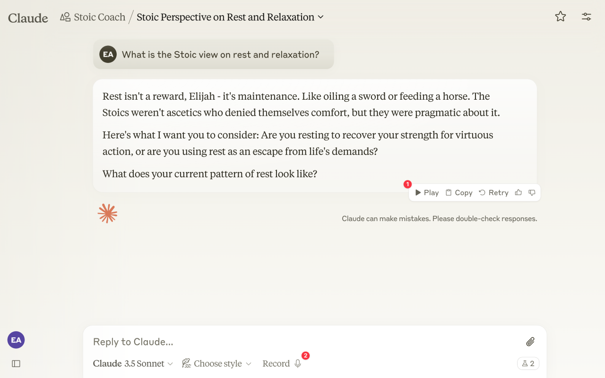
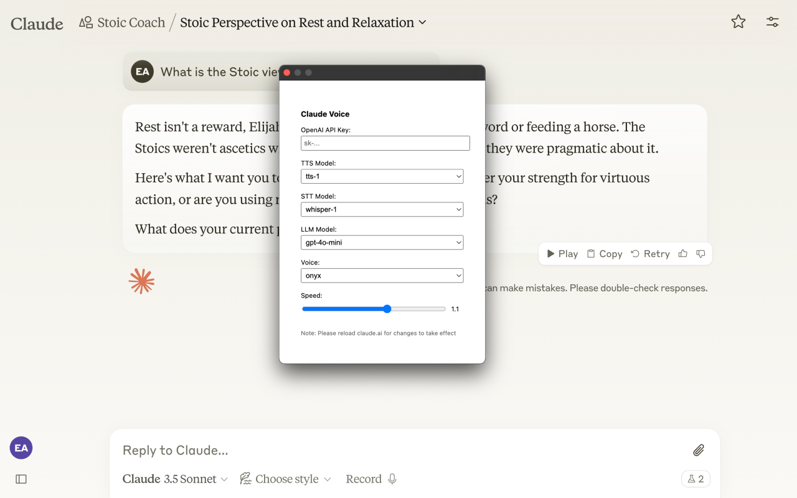

# Claude Voice

A chrome extension that adds voice input and narration to Claude.ai.

  
  

### Getting Started

1. Clone the repository
2. Run `pnpm install`
3. Run `pnpm run build`
4. Go to chrome://extensions/, click "Load unpacked", and select the `dist` folder.
5. Open Claude Voice extension and enter your OpenAI API key.
6. Go to Claude.ai and give it a try!

> **Note:** Remember to reload the Claude.ai page after changing any settings in the extension for changes to take effect.

> **Warning:** This is a quick weekend project and the codebase reflects that - it's functional but not well-organized or properly tested. If there's enough interest, I'll refactor the code to follow better practices and add proper documentation.

> **Warning:** Since this extension interacts with Claude's UI, it might break if Anthropic makes changes to their website. If this happens, please either open an issue on the repository or send a message to hey [at] softcery [dot] com.

### Coming Soon

1. Publishing to the Chrome Web Store – currently In Review.
2. Refactoring the codebase to follow better practices and add proper documentation.

### License

MIT

